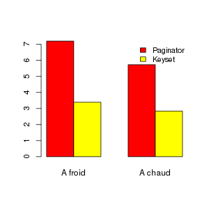
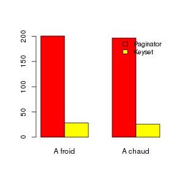

######################################
Paginator c'est bien, ... pour paginer
######################################

:date: 2014-09-18 14:00
:tags: django, paginator, offset, sql
:category: Astuces
:author: Rodolphe Quiédeville
:lang: fr
:slug: django-paginator-offset-keyset-pagination

Après la lecture de l'excellent article de Markus Winnand
intitulé `no-offset <http://use-the-index-luke.com/fr/no-offset>`_ dans lequel
il décrit la `pagination par clé` j'ai réalisé un
test pour mesurer l'impact de performance sur un cas réel. Django
propose de base la classe `Paginator
<https://docs.djangoproject.com/en/1.6/topics/pagination/>`_ pour
faire de la pagination, l'implémentation de celle-ci utilise OFFSET
lors de ses appels à la base de données. Si l'utilisation de cette
classe se justifie quand on veut naviguer avant/arrière dans une
liste, il arrive aussi que celle-ci soit utilisée lors d'une lecture
unique séquentielle, nous allons voir si cela est une bonne idée ou
pas.

La méthode
==========

La méthode utlisée consiste dans les 2 cas à lire la table par lots de
250 tuples, et d'appliquer un traitement pour certaines des
lignes. Dans le premier cas on utilise `Paginator`_

.. code-block:: python

  books = BigBook.objects.all().order_by('pk')
  paginator = Paginator(books, 250)
  for p in paginator.page_range:
      for book in paginator.page(p).object_list:
          # do what you want here
          if book.nbpages > 42:
              book.ma_methode()

Dans le deuxième cas la pagination est basée sur une clé triée (Keyset), et la
récupération de la dernière clé vue dans l'itération précédente

.. code-block:: python

    keyid = 0
    while True:
        books = BigBook.objects.filter(id__gt=keyid).order_by('id')[:250]
        for book in books:
            keyid = book.id
            # do want you want here
            if book.nbpages > 42:
                book.ma_methode()

        if len(books) < 250:
            break

Les mesures sont réalisées dans 2 configurations différentes, dans le
premier cas la table lue peut tenir en mémoire, dans le deuxième cas
non. Et afin d'être le plus exhaustif possible on comparera une
lecture à froid avec une lecture à chaud. Pour la lecture à froid, le
cache filesystem est vidé et le cluster **postgres** est redémarré afin de
vider les buffers.

Les résultats
=============

Que cela soit à froid ou à chaud dans les 2 cas de figure la
pagination par clé est gagnante en temps de réponse. Le gain est de
l'ordre de 50% quand la table n'est pas présente en mémoire, le delta
diminuant sensiblement quand celle-ci est en mémoire.

La vérification des buffers de postgres se faisant avec l'extension
`pg_buffercache
<http://www.postgresql.org/docs/9.3/static/pgbuffercache.html>`_, on
constate ici que la table
july_bigbook est présente à 100% en mémoire. (`source view <http://www.keithf4.com/a-large-database-does-not-mean-large-shared_buffers/>`_)

.. code-block:: rst

   relname     |  buffered  | buffers_percent | percent_of_relation 
 --------------+------------+-----------------+---------------------
  july_bigbook | 5192 kB    |             3.5 |               100.0

Le deuxième est plus intéressant, car cette fois la table entière
ne peut pas tenir en RAM, les différentes lectures après un démarrage à
froid versus lecture à chaud montrent un delta inférieur, ce qui
s'explique par la lecture séquentielle, on recommence à lire ce qui a
disparu du cache. Pour information sur cette plateforme les
shared_buffers sont de 144M, la taille de la table étant d'un peu plus de
180M sans compter les index.

La différence est nettement plus importante cette fois et la lecture
du graphique suffit, on passe de plus de 3 minutes à 26 secondes en
moyenne en utilisant la pagination par clé.

En conclusion
=============

S'il ne faut pas remettre en cause `Paginator`, il faut garder à
l'esprit qu'un bon outil n'est pas pertinent dans tous les cas d'usage.

Et si vous avez décidé de vous passer complètement d'OFFSET dans vos
développements vous êtes invité à utiliser la bannière proposée par
Markus dans son article `no-offset`_.

